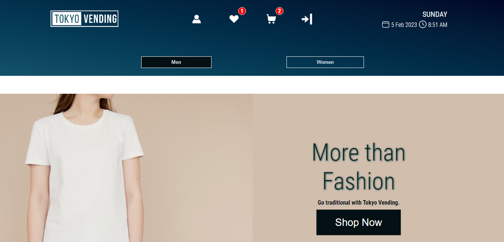
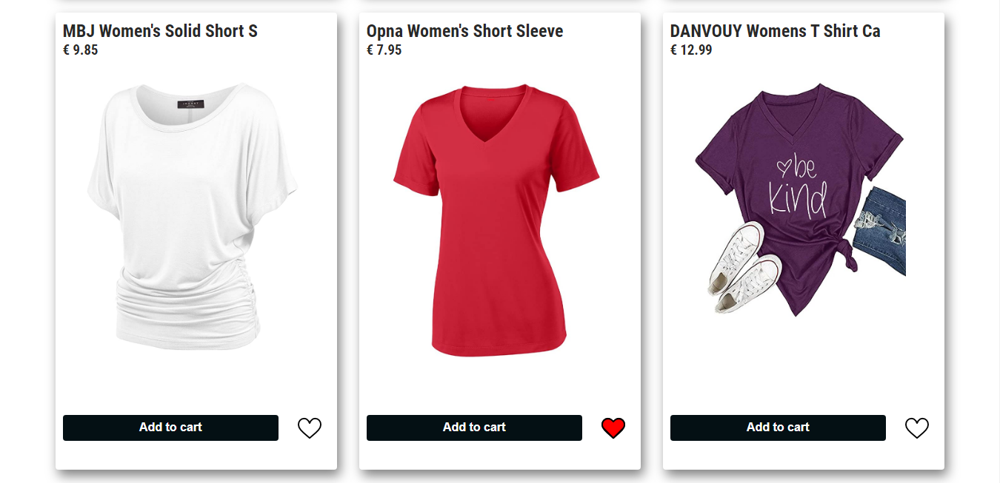
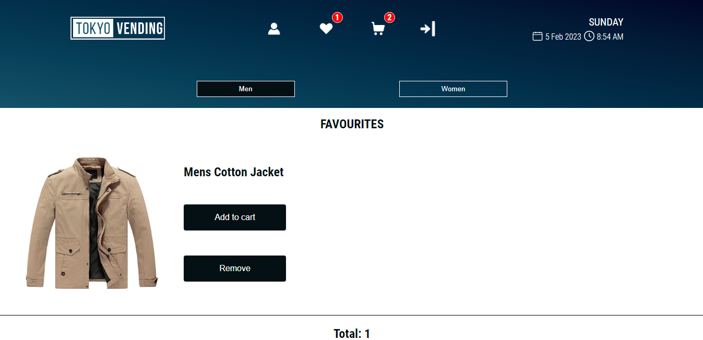

# Tokyo Vending Machine App

De applicatie is ontwikkeld om vending machines te voorzien van allerlei intelligente functies. Dit project laat ook zien hoe je met React een gebruiksvriendelijke gebruikerservaring op kunt bouwen, externe data kunt ophalen via een API en authenticatie kunt implementeren door gebruik te maken van een backend server waarin je nieuwe gebruikers kunt toevoegen en bestaande gebruikers kunt valideren.

## Functies

- Lijst van producten
- Productbeschrijving
- Productcategorie
- Favorieten toevoegen/verwijderen
- Winkelwagen
- Inloggen/registreren

## Screenshots







## Applicatie starten

Clone het project naar jouw locale machine en installeer eerst de node_modules door het volgende commando in de terminal te runnen:
```bash
  npm install 
```
Wanneer dit klaar is, kun je de applicatie starten met behulp van:
```bash
  npm start
```
Of gebruik de WebStorm knop (npm start). Open http://localhost:3000 om de pagina in de browser te bekijken.

## Registreren en inloggen

Om favorieten te kunnen toevoegen en bestellingen te kunnen plaatsen is het noodzakelijk om eerst te registreren en daarna in te loggen. Dit kun je doen door naar de registratie-pagina te gaan door  op het user-icoon te klikken. Klik op registreren en vul je gebruikersnaam, emailadres en wachtwoord in. Als je ingelogd bent heb je toegang tot je profielpagina en kun je favorieten toevoegen en de bestellingen plaatsen in de winkelwagen.  

## Schermontwerp

Ga naar mijn [Figma project](https://www.figma.com/file/QEuYNoFuw7LG67Jc0o6D9H/%F0%9F%97%BC-Tokyo-Vending?node-id=18%3A8&t=hdoM5KmHz54PmMEO-1) om de schermontwerpen te zien.
